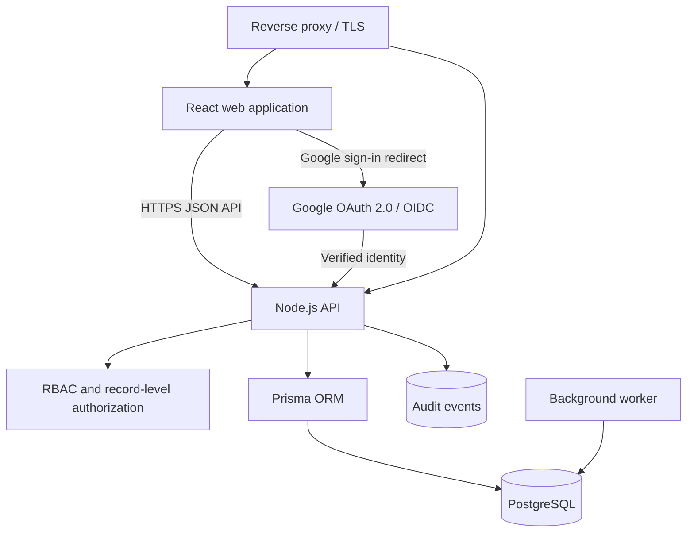

# Learnspace

Learnspace is an educator portal for academic planning, attendance, special-education observations, Individualized Education Programs (IEPs), and weekly progress reporting.

> [!IMPORTANT]
> The current repository is a functional frontend prototype originally developed in Google AI Studio. It is **not production-ready yet**: application data is stored in each browser's `localStorage`, identity is simulated through a role switcher, and no server-side authorization boundary exists. The production architecture described below is the intended migration target.

## Current capabilities

- Educator dashboard and reporting overview
- Student attendance entry
- Learning Journey calendar, editor, and approval workflow
- Special-education observation tools:
  - Functional Emotional Developmental Capacities (FEDC)
  - Sensory Profile
  - School Function Assessment (SFA)
- Annual IEP plans, goals, accommodations, and approval workflow
- Weekly IEP progress reports with goal synchronization
- Role-oriented views for teachers, coordinators, principals, and directors
- Seeded demo records for evaluating the workflows

## Current technology

| Area           | Current implementation                                      |
| -------------- | ----------------------------------------------------------- |
| UI             | React 19, TypeScript, Vite 6                                |
| Styling        | Tailwind CSS 4                                              |
| State          | React Context and component state                           |
| Persistence    | Browser `localStorage` via `src/services/storageService.ts` |
| Authentication | Demo-only user/role switcher                                |
| Backend        | None currently used                                         |
| Testing        | Vitest and React Testing Library smoke tests                |
| Packaging      | No Docker image yet                                         |

The package manifest retains Express tooling for the next API workspace milestone, but there is no active backend or Gemini integration in the application code. `metadata.json` remains temporarily as provenance and compatibility metadata for the prototype's Google AI Studio origin; the application does not load it at runtime.

## Project status

The repository is at **prototype/pre-alpha** maturity. Its current package version is `0.0.0`; the first production-foundation milestone should be released as `0.1.0` after the backend skeleton, Prisma schema, authentication boundary, and containerized development environment are working.

See:

- [`docs/ROADMAP.md`](docs/ROADMAP.md) for the production migration plan
- [`docs/VERSIONING.md`](docs/VERSIONING.md) for release and migration policy
- [`CHANGELOG.md`](CHANGELOG.md) for release history

## Repository structure

```text
.
├── src/
│   ├── components/           # Feature and shared React components
│   ├── context/AppContext.tsx
│   ├── data/seedData.ts      # Prototype/demo data
│   ├── services/storageService.ts
│   ├── App.tsx
│   ├── main.tsx
│   └── types.ts              # Current domain model
├── docs/
│   ├── ROADMAP.md
│   └── VERSIONING.md
├── index.html
├── metadata.json             # Google AI Studio metadata
├── package.json
├── tsconfig.json
└── vite.config.ts
```

## Run the current prototype

### Requirements

- Node.js `20.20.2` (pinned in [`.nvmrc`](.nvmrc)); newer compatible LTS releases are also accepted
- npm `10.8.2` or newer

### Installation

```bash
nvm use
npm ci
npm run dev
```

The repository sets `engine-strict=true`, so npm stops with an understandable engine error when the installed Node.js or npm version is below the supported minimum.

Open <http://localhost:3000>.

### Available scripts

```bash
npm run dev           # Start Vite on 0.0.0.0:3000
npm run build         # Build the frontend into dist/
npm run preview       # Preview the production frontend bundle
npm run format        # Format supported repository files
npm run format:check  # Check formatting without changing files
npm run lint          # Run ESLint, including React Hooks and unused-import checks
npm run typecheck     # Run the TypeScript no-emit check
npm test -- --run     # Run the frontend tests once in jsdom
npm run clean         # Remove generated frontend output and coverage
```

### Prototype data behavior

On first load, `src/services/storageService.ts` copies records from `src/data/seedData.ts` into browser `localStorage`. Data therefore:

- exists only in one browser profile;
- is not synchronized between users or devices;
- can be modified by anyone with browser developer tools;
- has no transaction, concurrency, backup, or audit guarantees;
- must not be treated as a secure store for real student information.

The role switcher in the header is also a demonstration tool, not authentication. UI checks are useful for presentation but cannot enforce access control.

## Target production architecture

The recommended migration preserves the React frontend while introducing a server-side API and PostgreSQL.



### Intended production components

- **Web:** existing React/Vite application, migrated from direct storage calls to typed API calls
- **API:** Node.js + TypeScript HTTP service with request validation, structured errors, authorization, health checks, and OpenAPI documentation
- **Database:** PostgreSQL managed through Prisma schema and migrations
- **Authentication:** server-side Google OAuth/OIDC with secure, `HttpOnly`, `Secure`, `SameSite` cookies
- **Authorization:** role-based and record-level checks on every protected API operation
- **Containers:** separate web/API and PostgreSQL services orchestrated by Docker Compose
- **Operations:** health checks, structured logs, backups, migration jobs, monitoring, and documented restore procedures

### Suggested production repository layout

This is a migration target, not the current layout:

```text
.
├── apps/
│   ├── web/                  # React/Vite frontend
│   └── api/                  # Node.js HTTP API
├── packages/
│   ├── contracts/            # Shared API schemas and generated types
│   └── config/               # Shared lint/TypeScript configuration
├── prisma/
│   ├── schema.prisma
│   ├── migrations/
│   └── seed.ts
├── docker/
├── docs/
├── compose.yaml
└── package.json
```

The repository should only be reorganized after the API boundary is defined; moving files first would create churn without improving security or reliability.

## Planned self-hosting workflow

The production Docker Compose setup should provide:

- `web`: static frontend served by a hardened web server or reverse proxy;
- `api`: Node.js API with an unprivileged runtime user;
- `db`: PostgreSQL with a named persistent volume;
- an explicit migration command/job using `prisma migrate deploy`;
- health checks and restart policies;
- optional `redis` only if sessions, queues, or rate limiting require it;
- separate development and production configuration.

A future production deployment should look similar to:

```bash
cp .env.example .env
# Configure database, public URL, session secret, and Google OAuth credentials.
docker compose up -d --build
docker compose run --rm api npm run db:migrate:deploy
```

These commands are illustrative until the Docker and API milestones in the roadmap are implemented.

## Planned configuration

The production environment contract should include variables equivalent to:

```dotenv
APP_URL=https://learnspace.example.org
DATABASE_URL=postgresql://learnspace:change-me@db:5432/learnspace
SESSION_SECRET=replace-with-at-least-32-random-bytes
GOOGLE_CLIENT_ID=your-google-oauth-client-id
GOOGLE_CLIENT_SECRET=your-google-oauth-client-secret
GOOGLE_ALLOWED_DOMAINS=example.org
LOG_LEVEL=info
```

Rules:

- Never commit real `.env` files or OAuth secrets.
- Configure Google OAuth redirect URIs for each environment.
- Refuse startup in production when required secrets are absent or weak.
- Treat domain allowlisting as an admission rule, not as the sole authorization mechanism.

## Google OAuth model

The recommended sign-in flow is authorization-code OAuth/OIDC handled by the API:

1. The user starts sign-in from the web application.
2. The API generates state/PKCE values and redirects to Google.
3. The callback validates state, issuer, audience, nonce, and token claims.
4. The API matches the verified Google identity to an internal `User` record.
5. New identities are rejected, invited, or provisioned according to instance policy.
6. The API creates a server-side session and sends only an opaque secure cookie.
7. Every API request loads the user and applies role and record-level authorization.

Google identity determines **who the user is**. Learnspace's database determines **what the user may access**. Roles must not be accepted from browser input or inferred only from an email domain.

For local development, use a dedicated OAuth client and callback such as `http://localhost:3000/api/auth/google/callback` (or the final API URL selected during implementation).

## Prisma and data migration direction

`src/types.ts` provides a useful domain inventory, but it is not yet a normalized relational model. Initial Prisma work should model at least:

- users, OAuth accounts, sessions, roles, and permissions;
- schools/organizations, units, grades, classes, and subjects;
- students and staff-to-student assignments;
- attendance records;
- learning journeys, projects, goals, cross-curricular links, and workflow events;
- observation definitions, assignments, FEDC records, sensory records, and SFA records;
- IEPs, team members, performance areas, accommodations, goals, services, and weekly reports;
- immutable audit events.

Some assessment response structures can start as PostgreSQL `Json` fields when their shape is instrument-specific, but identifiers, ownership, workflow state, dates, and fields used for filtering/reporting should be relational and indexed.

Before importing any browser data, create a one-time export/import format with schema versioning, validation, authorization checks, and a dry-run mode. Seed data must remain clearly separate from production data.

## Security and privacy baseline

Learnspace contains highly sensitive student, family, educational, and disability-related information. A production deployment should not launch until it has:

- server-side authorization for every read and write;
- least-privilege role definitions and record scoping;
- append-only audit logging for access and workflow changes;
- TLS at the ingress and encrypted backups;
- CSRF protection, secure cookies, OAuth state/PKCE, and restrictive CORS;
- request validation, rate limiting, and safe error responses;
- secret rotation and documented incident response;
- retention, export, correction, and deletion policies appropriate to applicable law;
- dependency, container, and source-code vulnerability scanning;
- recovery tests for database backups.

Compliance obligations vary by jurisdiction and organization. Deployment owners should review requirements such as FERPA, GDPR/UK GDPR, COPPA, Indonesia's Personal Data Protection Law, and local education policies with qualified counsel. This repository does not itself guarantee compliance.

## Development principles

- The API is the security boundary; never rely on hidden buttons for authorization.
- Use Prisma migrations for every database change.
- Keep demo data opt-in and impossible to seed accidentally in production.
- Validate API input at runtime in addition to TypeScript checks.
- Prefer explicit workflow state machines over loosely related status strings.
- Record actor, timestamp, and reason for sensitive workflow changes.
- Add tests with each migration from `storageService` to the API.
- Keep deployment reproducible from a clean clone and documented environment variables.

## Contributing

See [`CONTRIBUTING.md`](CONTRIBUTING.md) for local setup, branch, validation, and pull-request expectations. See [`SECURITY.md`](SECURITY.md) for private vulnerability reporting and [`docs/VERSIONING.md`](docs/VERSIONING.md) for commit, release, and migration conventions.

## License

No license file is currently present. Unless the repository owner adds one, copyright law reserves reuse and redistribution rights. Add an explicit license before inviting external distribution or contributions.
